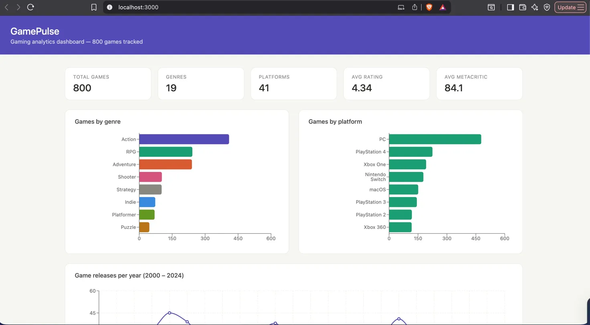

# GamePulse — Full-Stack Gaming Analytics Platform

A live gaming analytics platform that ingests data from the RAWG REST API,
stores it in PostgreSQL, serves it through a custom Flask REST API, and
displays it on a React dashboard with interactive charts.



---

## Architecture

```
RAWG REST API → Python ETL Pipeline → PostgreSQL → Flask API → React Dashboard
```

Each layer only talks to the one next to it — the same pattern used in
production data systems at scale.

---

## Tech Stack

| Layer | Technology |
|---|---|
| Data source | RAWG REST API (500K+ games) |
| ETL pipeline | Python, requests, pandas, SQLAlchemy |
| Database | PostgreSQL 15 |
| Backend API | Flask, Flask-CORS |
| Frontend | React 19, Recharts |
| Config | python-dotenv, .env secrets management |

---

## Features

### ETL Pipeline
- Fetches 800+ games across 20 paginated API requests
- Handles rate limiting (0.25s delay between requests) and error retries
- Transforms nested JSON into 5 normalized DataFrames
- Loads into PostgreSQL with foreign key constraints and deduplication
- Designed to run on a schedule for fresh data

### Database
- Normalized schema with 5 tables: games, genres, platforms,
  game_genres, game_platforms
- Many-to-many relationships via junction tables
- Indexes on rating, metacritic, and release date for fast queries
- 3 pre-built SQL views: genre_stats, platform_stats, yearly_releases

### Flask REST API
- `GET /api/health` — server health check
- `GET /api/stats` — aggregated KPIs
- `GET /api/games` — paginated games with genre filter and sort
- `GET /api/genres` — genre breakdown with avg ratings
- `GET /api/platforms` — top 15 platforms by game count
- `GET /api/yearly` — yearly release trends 1990–2024
- `GET /api/rating-distribution` — rating bucket breakdown

### React Dashboard
- KPI cards: total games, genres, platforms, avg rating, avg metacritic
- Genre bar chart (top 8 genres by game count)
- Platform bar chart (top 8 platforms by game count)
- Yearly releases line chart (2000–2024)
- Top 20 rated games table

---

## Database Schema

```sql
games         — id, name, released, rating, metacritic, playtime
genres        — id, name, slug
platforms     — id, name, slug
game_genres   — game_id, genre_id  (junction)
game_platforms — game_id, platform_id  (junction)
```

---

## Key Stats (current dataset)

| Metric | Value |
|---|---|
| Games tracked | 800 |
| Genres | 19 |
| Platforms | 41 |
| Avg rating | 4.34 / 5.0 |
| Avg Metacritic | 84.1 / 100 |
| Top rated game | The Witcher 3: Wild Hunt – Blood and Wine (4.81) |

---

## Setup

### Prerequisites
- Python 3.10+
- PostgreSQL 15
- Node.js 18+
- RAWG API key (free at rawg.io)

### 1. Clone and install

```bash
git clone https://github.com/satvik/gamepulse.git
cd gamepulse
python -m venv venv
source venv/bin/activate
pip install requests pandas sqlalchemy psycopg2-binary flask flask-cors python-dotenv
```

### 2. Configure environment

```bash
cp .env.example .env
# Fill in your RAWG_API_KEY and PostgreSQL credentials
```

### 3. Set up the database

```bash
psql -U postgres -c "CREATE DATABASE gamepulse;"
psql -U postgres -d gamepulse -f backend/etl/schema.sql
```

### 4. Run the ETL pipeline

```bash
python backend/etl/pipeline.py
```

### 5. Start the Flask API

```bash
python backend/api/app.py
```

### 6. Start the React dashboard

```bash
cd frontend
npm install
npm start
```

Open `http://localhost:3000`

---

## Project Structure

```
gamepulse/
├── backend/
│   ├── etl/
│   │   ├── schema.sql       # PostgreSQL schema and views
│   │   └── pipeline.py      # ETL pipeline (extract, transform, load)
│   └── api/
│       └── app.py           # Flask REST API
├── frontend/
│   └── src/
│       ├── App.js           # Root component, data fetching
│       ├── App.css          # Global styles
│       └── components/
│           ├── StatsBar.jsx
│           ├── GenreChart.jsx
│           ├── PlatformChart.jsx
│           ├── YearlyChart.jsx
│           └── TopGames.jsx
├── .env.example             # Environment variable template
├── .gitignore
└── README.md
```
